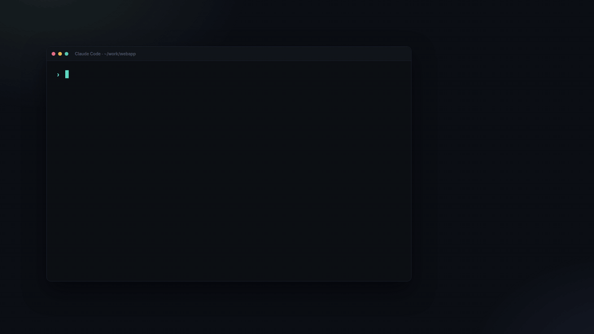
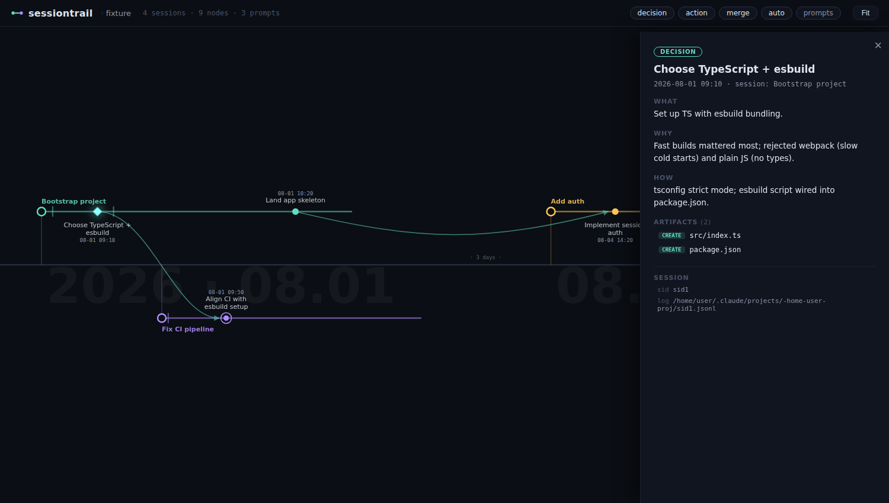

# session-trail

[](https://github.com/jsk4581/session-trail/actions/workflows/test.yml)
[](https://nodejs.org)
[](#install)
[](#install)
[](LICENSE)

**Your project's development history, as a timeline.**

session-trail is a Claude Code plugin that records what actually happened in a project (sessions, decisions, completed work, and the files they touched) and renders it as an interactive left-to-right timeline.

It looks like a git graph, but the branches and merges aren't git commands: they're **judgment calls recorded by the LLM as it works**. Each Claude Code session becomes a lane; significant decisions and actions become nodes on that lane; work that continues an earlier session's line becomes a merge edge across lanes.



## How it works

session-trail captures history three ways, layered so you get a useful timeline even if you never think about it:

1. **Automatic (hooks)**: every session registers a lane, **every user prompt is recorded verbatim** as a faint tick on that lane, every file you create or edit is captured as an artifact touch, and the session title is backfilled automatically. Zero effort, zero latency (recording hooks run async).
2. **LLM judgment (the interesting part)**: at session start, Claude is briefed on the recording protocol. When it makes a significant decision (a choice between alternatives, a reversal, a completed unit of work, or work that merges an earlier session's line), it hands a short brief to a Sonnet scribe subagent, which writes the milestone (`title` / `what` / `why` / `how`, with `why` required to include the rejected alternatives) and records it. The main agent only judges significance; the scribe does the writing in the background, so the conversation is never slowed down.
3. **Safety net**: if a session does real work but no milestone was recorded, session end synthesizes an auto-node from the session title and touched files, so nothing disappears.

The prompt ticks matter: they are the mechanical, complete record of what you asked, independent of the LLM's judgment. Click a tick to read the prompt; together with the session id and transcript path shown on every node, a person or another agent can always get back to the original conversation.

Every node carries its **artifacts**: the files created or modified around that point, attached automatically. Click a node to see what/why/how and the artifact list, with inline file preview.



## Why not a code graph?

Code-graph tools remember what the code looks like right now: functions, calls, dependencies. session-trail remembers why it got that way: sessions, decisions, rejected alternatives, and the words that asked for them. The two answer different questions and run side by side in the same session without stepping on each other. What session-trail adds:

- **A timeline, not a graph of the code.** Other tools visualize structure, a map of what depends on what. It shows how the code is shaped, not how it got there. session-trail draws time instead: one lane per session, a node per decision, merges where a later session picks up an earlier line. Read left to right, it tells the story of the project.
- **Time is never erased.** A code graph aims to be current, so stale detection and rebuilds overwrite the past. session-trail is append-only: a decision that no longer matches the code stays, together with why it made sense at the time.
- **Decisions are first-class data.** A code graph is built by parsing; rationale lives in a hand-written note or a separate ADR file, if anywhere. Here the agent doing the work decides what mattered, and a Sonnet scribe subagent records it as a decision node that requires a `why`, is asked for the rejected alternatives, and is bound automatically to its time, session, and touched files.
- **Your own words and the original conversation survive.** Every user prompt is recorded verbatim, mechanically, independent of any model's judgment, and every node carries its session id and the path of the local transcript. "What exactly did I ask for back then" has an answer in the original wording, and a person or another agent can open the exact dialogue a decision came from.
- **It does not interrupt.** Nothing is pushed into the context on every edit. The agent pulls from the timeline only when it is about to undo an existing choice; ordinary turns cost nothing.
- **Plain text, committable, dependency-free.** One JSONL file that diffs, reviews, and shares through git. No binary database, no daemon, no indexer, no API key, no npm packages.
- **Built for people first.** The agent-facing queries sit on top of a viewer made for humans, not the other way round.
- **Alignment you can inspect.** The most consequential thing an agent does is not editing a file, it is deciding that something mattered and why. The timeline is where human intent and agent judgment get reconciled.

## Install

```
/plugin marketplace add jsk4581/session-trail
/plugin install session-trail@session-trail
```

Requires Node.js ≥ 18 (for the hooks, CLI, and viewer server). Zero npm dependencies.

## Use

| Command | What it does |
|---|---|
| `/session-trail:view` | Start the timeline viewer and get its URL |
| `/session-trail:note <what happened>` | Manually record a milestone |

The viewer: scroll to zoom, drag to pan, double-click to fit, click a node to open its detail card. Long idle gaps are compressed (`· 3 days ·`) so months of history fit on one screen. Filter chips toggle decision/action/merge/auto nodes and the faint prompt ticks (every user message).

### CLI

Everything also works without Claude Code:

```bash
node bin/session-trail.mjs add       # append a milestone (JSON on stdin)
node bin/session-trail.mjs recent    # list recent nodes  [--n 10] [--session last|<sid>]
node bin/session-trail.mjs show <id> # one node in full: what/why/how, artifacts, session, merges
node bin/session-trail.mjs why <path>     # milestones that touched a file or directory
node bin/session-trail.mjs search <text>  # search milestones and recorded prompts
node bin/session-trail.mjs serve     # start the viewer [--host] [--port]
node bin/session-trail.mjs build     # force-rebuild the graph cache
node bin/session-trail.mjs doctor    # sanity-check the installation
```

## Data & privacy

All data lives in **`.session-trail/` inside your project**: a single append-only `events.jsonl` plus a derived graph cache. Nothing leaves your machine.

- **Commit `.session-trail/`** to share the timeline with your team, or
- **gitignore it** to keep history personal.

Note that `events.jsonl` contains your prompts verbatim (truncated at 2000 characters). Check it before committing the directory to a shared repository.

The viewer binds `127.0.0.1` by default and gates data endpoints behind a per-start token. To serve on another interface (e.g. to view from a different machine), pass `--host <address>`; the token still applies.

## Event model

`events.jsonl` is the single source of truth; the graph is a pure reduction over it (safe under concurrent sessions: appends only, ordered by timestamp).

| Event | Written by | Meaning |
|---|---|---|
| `session` | SessionStart hook | new lane |
| `title` | Stop hook | session title backfill |
| `touch` | PostToolUse hook | file created/edited |
| `prompt` | UserPromptSubmit hook | every user message (shown as faint lane ticks) |
| `milestone` | the LLM (or you, or the safety net) | decision / action / merge node |
| `session_end` | SessionEnd hook | lane closed |

## License

MIT
